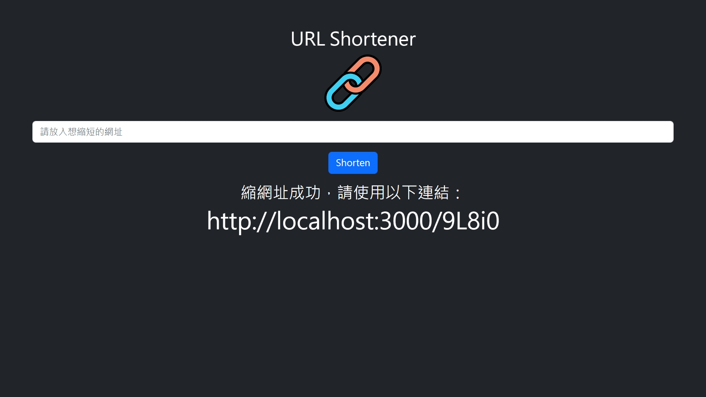
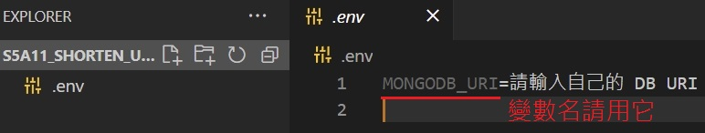

# 短網址產生器
本專案以練習 路由、handlebars、refactoring 為主要目的，提供生成短網址的服務。  
(參考下圖)，請輸入想縮短的網址，並點選 Shorten 按鍵，便能生成短網址。


## 如何才能使用 (請在有 Node.js 的環境下使用本專案)
1. 開啟終端機 (git Bash / Terminal / console)，並 cd 至您想擺放專案的位置
2. 執行
```
git clone https://github.com/chikunmark/S5A11_shorten_url.git
```
3. 進入專案資料夾
```
cd S5A11_shorten_url
```
4. 本專案有使用環境變數，並使用 mongoose 連接 MongoDB，請參考下圖，  
自行在當下目錄，建立連結到您的 MongoDB 的 URI  
(變數名請用 MONGODB_URI)  


5. 安裝必要套件
```
npm install
``` 
6. 執行環境
```
npm run dev
```  
7. 開啟瀏覽器 (Chrome, Firefox 等)，並進入以下網址，即可使用本專案  
http://localhost:3000
  
8. 若想停止環境 (停用專案)，請在終端機按下 Ctrl + C (windows)，或其 OS 的相應按鍵

謝謝您！

## 使用工具、套件
* Node.js@18.12.0
* npm@8.19.2
* express@4.18.2
* express-handlebars@6.0.6
* mongoose@5.9.13
* body-parser@1.20.1 (內建於 express，直接使用其功能)
* dotenv@16.0.3
